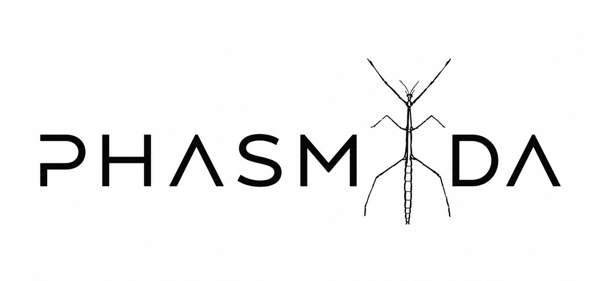

# PHASMIDA
<p align="center">
  
</p>

[](https://www.docker.com)
[](https://www.python.org/)
[](https://streamlit.io)
[](https://www.kali.org)
[](https://www.nmea.org)


---

## 📖 Overview

PHASMIDA is a Python-based application developed as part of a Master's Thesis.
The project focuses on the acquisition, processing and analysis of NMEA messages,
providing real-time visualization and tools for monitoring GNSS/GPS data.

---

## ✨ Features

- 📡 Real-time NMEA data acquisition
- 🛰 GNSS message decoding
- 📈 Data visualization
- 💾 Data logging
- 🔍 Packet analysis
- 🐍 Cross-platform Python application

---

## 📂 Project Structure

```text
PHASMIDA/
│
├── docs/           # Thesis documentation
├── images/         # Screenshots and diagrams
├── src/            # Source code
├── tests/          # Unit tests
├── requirements.txt
└── README.md
```

---

## 🚀 Getting Started

Clone the repository

```bash
git clone https://github.com/ABJ-C0d3Hu6/PHASMIDA.git
cd PHASMIDA
```

Install dependencies

```bash
pip install -r requirements.txt
```

Run

```bash
python main.py
```

---

## 📷 Screenshots

*(Add screenshots here once the application is finished.)*

---

## 🛠 Technologies

- Python
- NMEA 0183
- GNSS
- Kali Linux
- Git
- GitHub

---

## 📚 Documentation

The complete Master's Thesis documentation can be found in the `docs` folder.

---

## ⚖️ License

This project is licensed under the MIT License.

---

## 👤 Author

**Alejandro Bermejo Jimeno**

Thesis Project - MSc in Telecommunications Engineering - Universidad de Alicante (UA)
